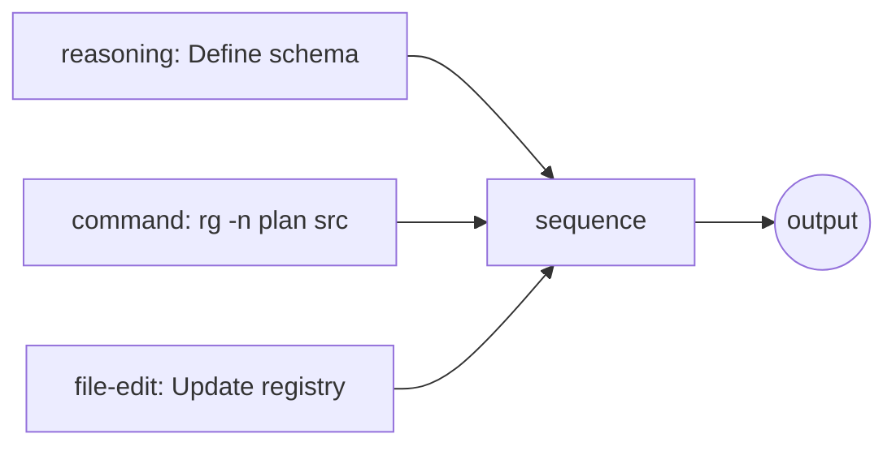

# M-Mermaid: Plan Diagram Viewer

**Type**: Feature (Future)
**Depends**: Plan wiring system (plan_wiring.clj), SSE notebook viewer
**Related**: `scripts/musn-plan`, `resources/musn-plan-components.edn`

---

## Owner

Codex

## Scope

### Scope In

- Implement `plan->mermaid` conversion for plan wiring EDN.
- Add a minimal HTTP endpoint to render the latest plan as Mermaid in the notebook viewer.
- Render inline diagrams for `:turn/plan` events with basic styling.

### Scope Out

- Production-grade frontend polish and advanced interactions (click-to-jump, caching, perf tuning).
- External CDN dependency decisions (treat as separate decision if it becomes contentious).

## Time Box

1 day for a working prototype (conversion + endpoint + basic viewer integration).

## Exit Conditions

- Standalone endpoint renders a real plan correctly, and notebook viewer shows inline diagrams for plan turns.
- If integration requires major viewer refactors, stop and split into conversion-only and viewer-only missions.

## Objective

Render MUSN plan wiring diagrams as Mermaid flowcharts in the HTTP notebook viewer, providing visual feedback on plan structure before execution.

---

## Architecture

### EDN to Mermaid Conversion

Input (plan wiring EDN):
```clojure
{:nodes [{:id :s1 :component :musn.plan/action-reasoning
          :params {:note "Define schema"}}
         {:id :s2 :component :musn.plan/action-command
          :params {:cmd "rg -n plan src"}}
         {:id :s3 :component :musn.plan/action-file-edit
          :params {:note "Update registry"}}
         {:id :seq :component :musn.plan/sequence}]
 :edges [{:from :s1 :to :seq :to-port :actions}
         {:from :s2 :to :seq :to-port :actions}
         {:from :s3 :to :seq :to-port :actions}]
 :output :seq}
```

Output (Mermaid):


### Component Styling

Map component types to Mermaid node shapes:
- `:action-reasoning` → `[note]` (rectangle)
- `:action-command` → `[[cmd]]` (stadium)
- `:action-file-edit` → `[(file)]` (cylinder)
- `:action-tool` → `{{tool}}` (hexagon)
- `:sequence` → `[seq]` (rectangle)
- `:parallel` → `[/parallel/]` (parallelogram)
- `:if-then-else` → `{cond}` (diamond)
- `:gate` → `{gate}` (diamond)

### Endpoints

1. **Standalone diagram endpoint**:
   ```
   GET /fulab/plan/:session-id/diagram
   ```
   Returns HTML page with Mermaid.js rendering the latest plan.

2. **Inline in notebook**:
   When `:turn/plan` events arrive via SSE, render diagram inline in the notebook viewer.

### Frontend Integration

Add Mermaid.js to notebook.html:
```html
<script src="https://cdn.jsdelivr.net/npm/mermaid/dist/mermaid.min.js"></script>
<script>mermaid.initialize({startOnLoad: true, theme: 'dark'});</script>
```

Render plan events as:
```html
<div class="turn plan">
  <div class="mermaid">
    flowchart LR
    ...
  </div>
</div>
```

---

## Implementation Steps

1. **Add `plan->mermaid` function** in `plan_wiring.clj`
   - Convert nodes to Mermaid node definitions
   - Convert edges to Mermaid arrows
   - Apply component-specific styling

2. **Add HTTP endpoint** in `transport.clj`
   - `GET /fulab/plan/:session-id/diagram`
   - Pull latest plan from session events
   - Return HTML with embedded Mermaid

3. **Update notebook viewer**
   - Add Mermaid.js dependency
   - Detect `:turn/plan` events in ClojureScript
   - Render diagram div with mermaid class

4. **Style integration**
   - Dark theme compatible colors
   - Match notebook accent colors (user blue, agent purple)

---

## Success Criteria

- [ ] `plan->mermaid` correctly converts wiring EDN
- [ ] Standalone diagram endpoint renders plans
- [ ] Notebook viewer shows inline diagrams for plan events
- [ ] Mermaid dark theme matches notebook styling
- [ ] Parallel/conditional nodes render distinctly

---

## Notes

- Mermaid supports subgraphs for nested structures (parallel groups)
- Could add click handlers to jump to related events
- Risk/confidence scores could be shown as node annotations
- Consider caching rendered diagrams for performance

---

## Origin

Extension of live notebook viewer (2026-01-26), leveraging Codex's plan wiring system.
